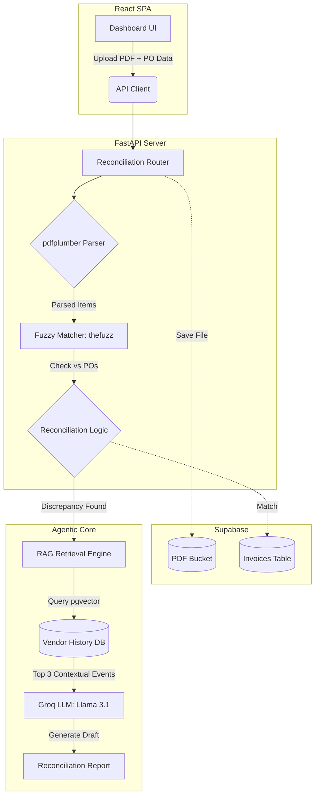

# 📖 RevFlow-Ai — Comprehensive Technical Documentation

*Agentic AI Finance Agent | Full-Stack Accounts Receivable Automation*

---

## 1. Executive Summary

RevFlow-Ai is a production-grade, full-stack autonomous finance pipeline designed to automate two of the most manual and error-prone parts of Accounts Receivable:
1. **Invoice Matching & Discrepancy Detection**: Validating unstructured vendor PDF invoices against internal Purchase Orders line-by-line.
2. **Accounts Receivable Collections**: Escalating late invoices through a 3-stage sequence autonomously using an intelligent LLM.

The system replaces manual spreadsheet validation and generic email templates with an **Agentic AI** pipeline powered by **Retrieval-Augmented Generation (RAG)**, enabling the system to draft historically-aware, context-rich communications that adapt to past vendor interactions.

---

## 2. Core Architecture & Tech Stack

The architecture is designed to be highly resilient, entirely free-tier deployable, and API-first.

### 2.1 The Tech Stack
*   **Backend REST API**: FastAPI (Python 3.12+)
*   **Frontend Dashboard**: React + Vite + Tailwind CSS (Lucide-React for icons)
*   **Database & Storage**: Supabase (PostgreSQL with `pgvector` extension)
*   **AI Engine (LLM)**: Groq API using `llama-3.1-8b-instant` (Extremely fast, low-latency open-source inference)
*   **RAG Embeddings**: `sentence-transformers` (`all-MiniLM-L6-v2`) running locally on the backend to avoid API costs.
*   **PDF Extraction**: `pdfplumber` (Python)
*   **Fuzzy Matching**: `thefuzz` + `python-Levenshtein`
*   **Automated Scheduler**: `APScheduler` (internal) + `cron-job.org` (external redundant trigger)
*   **SMTP Provider**: Python `smtplib` via Gmail App Passwords

### 2.2 Component Data Flow Architecture



---

## 3. Intelligent Agent Pipelines

### 3.1 The Reconciliation Agent (The "Eyes")

The reconciliation agent replaces manual data entry with a multi-layered extraction and validation process.

#### 1. Resilient Parsing Hierarchy
Invoices are highly unstructured. The agent uses a fallback mechanism:
*   **Attempt 1 (`extract_table`)**: Tries to parse the PDF as a structured digital grid. Highly accurate for digitally generated PDFs.
*   **Attempt 2 (`extract_text`)**: If tables fail or are missing, it falls back to Regex-based string parsing, hunting for currency symbols and typical invoice layouts.
*   **Fail Safe (`PARSE_FAILED`)**: If both fail (e.g., scanned images or heavily stylized docs), the system sets the invoice status to `PARSE_FAILED` and alerts the user. It does *not* fail silently or hallucinate data.

#### 2. Fuzzy Semantic Matching
*   Invoices rarely match POs exactly (e.g., vendor bills "MBP 14-inch" but PO says "MacBook Pro").
*   The agent uses **Levenshtein distance** to calculate string similarity.
*   Items matching above a configurable **Confidence Threshold (default 80%)** are accepted. Anything lower is flagged as `UNKNOWN`.

#### 3. Mathematical Auditing
For each matched item, the system applies strict validation rules:
*   `billed_qty == expected_qty`
*   `billed_price == expected_price`
If either check fails, the item is flagged as a `DISCREPANCY` and assigned a clear English reasoning string (e.g., "Price mismatch: Billed $1999, Expected $1899").

---

### 3.2 The Collections Agent (The "Voice")

The collections agent tracks invoice due dates via the scheduler and autonomously escalates through 3 distinct stages. 
**Crucial Rule:** Any invoice marked as `DISCREPANCY` is automatically excluded from the collections pipeline to prevent demanding payment for an incorrect bill.

#### Stage 1: Polite Reminder (1-7 Days Overdue)
*   **Trigger**: Invoice status `OVERDUE` and `days_overdue` between 1 and 7.
*   **LLM Prompt Instruction**: "Assume it may be an oversight. Keep it under 4 sentences. Be friendly."
*   **State Update**: `collections_stage` = 1, `last_reminder_sent` updated.

#### Stage 2: Payment Plan Proposal (After 2 Ignored Reminders)
*   **Trigger**: Invoice is still unpaid, `reminder_count` >= 2.
*   **LLM Prompt Instruction**: "Propose exactly 2 concrete payment plan options: Option A: Pay 50% now and the remainder in 30 days. Option B: Pay in 3 equal monthly installments. Minimum down payment is 25%. Tone: understanding but firm."
*   **State Update**: `collections_stage` = 2, `last_reminder_sent` updated.

#### Stage 3: Final Notice + Human Escalation
*   **Trigger**: 14 days have passed since Stage 2 was sent with no response.
*   **LLM Prompt Instruction**: "Inform them this account will now be escalated to a human team member for review. Tone: formal and firm, no threats."
*   **State Update**: `collections_stage` = 3, `flagged_for_human` = True. Automation stops.

---

## 4. The RAG Engine (Retrieval-Augmented Generation)

Without RAG, AI-generated emails are static and generic. With RAG, **every email generated by RevFlow-Ai is historically aware.**

### Technical Implementation:
1.  **Embedding Generation**: When a significant event occurs (e.g., a dispute is raised, a payment plan is offered), a text summary of the event is passed to `sentence-transformers` running locally. It generates a 384-dimensional floating-point array (vector).
2.  **Vector Storage**: The vector is inserted into the Supabase `vendor_history` table into a column typed as `VECTOR(384)`.
3.  **Context Retrieval (Cosine Similarity)**: Before calling Groq to generate a new email, the backend generates a vector for the *current* situation. It then queries Supabase using the `<=>` operator (Cosine Distance) to find the top 3 most semantically similar historical events for that specific vendor.
4.  **Prompt Injection**: The retrieved historical text is appended to the Groq `system_prompt` as `<past_context>`.

*Example RAG-Augmented Output*: "As we discussed in March regarding the pricing on the Magic Mouse, our agreed PO rate remains $79.00."

---

## 5. Database Schema Details (Supabase PostgreSQL)

The schema is normalized to separate concerns between raw invoice data, line-item reconciliation reports, and agent audit logs.

### 5.1 `purchase_orders`
*   `id` (uuid, pk)
*   `po_number` (varchar)
*   `item_name` (varchar)
*   `quantity` (int)
*   `unit_price` (numeric)

### 5.2 `invoices`
*   `id` (uuid, pk)
*   `invoice_number` (varchar)
*   `vendor_name` (varchar)
*   `status` (enum: PENDING, MATCHED, DISCREPANCY, OVERDUE, PAID)
*   `collections_stage` (int: 0, 1, 2, 3)
*   `flagged_for_human` (boolean)

### 5.3 `reconciliation_reports`
*   `id` (uuid, pk)
*   `invoice_id` (uuid, fk)
*   `discrepancy_details` (jsonb)
*   `email_draft` (text)

### 5.4 `vendor_history` (RAG Store)
*   `id` (uuid, pk)
*   `vendor_name` (varchar)
*   `event_description` (text)
*   `embedding` (vector(384))

### 5.5 `audit_logs`
*   `id` (uuid, pk)
*   `invoice_id` (uuid, fk)
*   `agent` (enum: RECONCILIATION, COLLECTIONS)
*   `action_taken` (varchar)
*   `reasoning` (text) - *Crucial for AI transparency*

---

## 6. API Endpoint Reference

All endpoints are prefixed with `/api`.

| Method | Endpoint | Payload / Params | Description |
| :--- | :--- | :--- | :--- |
| **POST** | `/api/reconcile` | `multipart/form-data` (file, vendor_name, po_reference, threshold) | Uploads PDF, parses, matches POs, generates drafts, saves to DB. |
| **GET** | `/api/invoices` | `?limit=50&status=OVERDUE` | Fetches invoices with optional filtering. |
| **PATCH**| `/api/invoices/{id}/status` | `{"status": "PAID"}` | Manually overrides an invoice status. |
| **POST** | `/api/collections/run-all` | *None* | Triggered by Scheduler. Checks all invoices, escalates stages, sends emails. |
| **GET** | `/api/collections/preview/{id}`| *None* | Generates the *next* intended collections email without sending it. |
| **GET** | `/api/stats` | *None* | Aggregates DB metrics for the Dashboard cards and charts. |
| **GET** | `/api/audit-logs` | `?limit=10` | Retrieves chronological ledger of AI actions. |
| **POST** | `/api/demo/load` | *None* | Populates the database with sample POs, Invoices, and Logs for testing. |
| **POST** | `/api/demo/clear` | *None* | Wipes all demo data from the database. |

---

## 7. Automated Scheduler Resilience

Relying entirely on a FastAPI internal scheduler (`APScheduler`) is risky on free-tier hosting platforms (like Render), which spin down containers after 15 minutes of inactivity. If the server is asleep when the trigger time arrives, the job is missed entirely.

**The Resilience Strategy:**
RevFlow-Ai utilizes a **dual-trigger system**:
1.  **Internal Primary**: `APScheduler` runs inside FastAPI as the primary trigger, firing at the time defined in `.env` (`COLLECTIONS_RUN_TIME=09:00`).
2.  **External Redundancy**: An external cron service ([cron-job.org](https://cron-job.org)) is configured to hit `POST /api/collections/run-all` exactly 5 minutes after the primary trigger. This wakes the sleeping server up and guarantees the collections sweep runs exactly once every 24 hours. The endpoint is idempotent for the day.

---

## 8. Deployment & Environment Configuration

The application is fully configured for simultaneous local development and cloud production without requiring code changes.

### 8.1 Live Production URLs
*   **Frontend**: [https://revflowai.vercel.app](https://revflowai.vercel.app)
*   **Backend**: [https://revflow-ai.onrender.com](https://revflow-ai.onrender.com)

### 8.2 CORS Security & Strategy
The backend (`main.py`) dynamically and securely accepts requests using FastAPI's `CORSMiddleware`:
```python
    allow_origins=[
        "http://localhost:5173",
        "https://revflowai.vercel.app",
        os.getenv("FRONTEND_URL", "http://localhost:5173"),
    ]
```

**Benefits of this setup:**
1.  You can run `npm run dev` locally and it will seamlessly communicate with the deployed Render backend if your local `.env` points to `VITE_API_URL=https://revflow-ai.onrender.com`.
2.  You can run both entirely locally.
3.  The production Vercel site is explicitly whitelisted, guaranteeing it will never hit CORS blocking against the Render backend.

---

*End of Documentation*
