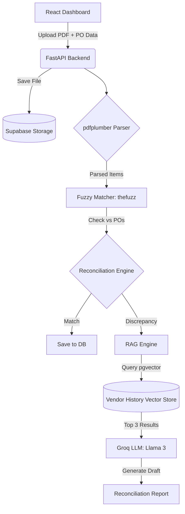

# 📖 RevFlow-Ai — Comprehensive Technical Documentation

*Agentic AI Finance Agent | Full-Stack Accounts Receivable Automation*

---

## 1. Executive Summary

RevFlow-Ai is a production-grade, full-stack autonomous finance pipeline designed to automate two of the most manual and error-prone parts of Accounts Receivable:
1. **Invoice Matching & Discrepancy Detection**: Validating unstructured vendor PDF invoices against internal Purchase Orders.
2. **Accounts Receivable Collections**: Escalating late invoices through a 3-stage sequence autonomously using an intelligent LLM.

The system replaces manual spreadsheet validation and generic email templates with an **Agentic AI** pipeline powered by **Retrieval-Augmented Generation (RAG)**, enabling the system to draft historically-aware, context-rich communications.

---

## 2. Core Architecture & Tech Stack

The architecture is designed to be highly resilient, entirely free-tier deployable, and API-first.

### 2.1 The Tech Stack
*   **Backend REST API**: FastAPI (Python 3.12+)
*   **Frontend Dashboard**: React + Vite + Tailwind CSS
*   **Database & Storage**: Supabase (PostgreSQL with `pgvector` extension)
*   **AI Engine (LLM)**: Groq API using `llama3-8b-8192` (Extremely fast, low-latency open-source inference)
*   **RAG Embeddings**: `sentence-transformers` (`all-MiniLM-L6-v2`) running locally on the backend.
*   **PDF Extraction**: `pdfplumber` (Python)
*   **Fuzzy Matching**: `thefuzz` + `python-Levenshtein`
*   **Automated Scheduler**: APScheduler (internal) + cron-job.org (external redundant trigger)
*   **SMTP Provider**: Python `smtplib` via Gmail App Passwords

### 2.2 Component Data Flow

---

## 3. Intelligent Agent Pipelines

### 3.1 The Reconciliation Agent (The "Eyes")

The reconciliation agent replaces manual data entry with a multi-layered extraction and validation process.

#### 1. Resilient Parsing Hierarchy
*   **Attempt 1 (`extract_table`)**: Tries to parse the PDF as a structured digital grid.
*   **Attempt 2 (`extract_text`)**: If tables fail, falls back to Regex-based string parsing.
*   **Fail Safe (`PARSE_FAILED`)**: If both fail (e.g., scanned images), the system flags the invoice as `PARSE_FAILED` requiring human review. It does *not* fail silently.

#### 2. Fuzzy Semantic Matching
*   Invoices rarely match POs exactly (e.g., "MBP 14-inch" vs "MacBook Pro").
*   The agent uses **Levenshtein distance** to calculate string similarity.
*   Items matching above an **80% confidence threshold** are accepted. Anything lower is flagged as `UNKNOWN`.

#### 3. Mathematical Auditing
For each matched item, the system validates:
*   `billed_qty == expected_qty`
*   `billed_price == expected_price`
If either check fails, the item is flagged as a `DISCREPANCY` and assigned a clear English reasoning string.

---

### 3.2 The Collections Agent (The "Voice")

The collections agent tracks invoice due dates and autonomously escalates through 3 distinct stages. **Crucially, any invoice marked as a `DISCREPANCY` is automatically excluded from the collections pipeline.**

#### Stage 1: Polite Reminder (1-7 Days Overdue)
*   **Trigger**: Invoice is `PENDING` or `OVERDUE` and `days_overdue` is between 1 and 7.
*   **Action**: Groq generates a friendly, polite payment reminder assuming an oversight.
*   **State Update**: `collections_stage` = 1.

#### Stage 2: Payment Plan Proposal (After 2 Ignored Reminders)
*   **Trigger**: Invoice is still unpaid, `reminder_count` >= 2.
*   **Action**: Groq generates an email proposing two concrete payment plans. The prompt enforces strict constraints: *Minimum 25% upfront, maximum 3 equal installments.*
*   **State Update**: `collections_stage` = 2.

#### Stage 3: Final Notice + Human Escalation
*   **Trigger**: 14 days have passed since Stage 2 was sent with no response.
*   **Action**: Groq generates a firm final notice.
*   **State Update**: `collections_stage` = 3, `flagged_for_human` = True.

---

## 4. The RAG Engine (Retrieval-Augmented Generation)

Without RAG, AI-generated emails are generic. With RAG, **every email is historically aware**.

### How it works:
1.  **Embedding Generation**: When an event occurs (a dispute is raised, a payment plan is ignored), the text describing the event is embedded into a 384-dimensional vector using `sentence-transformers` locally.
2.  **Storage**: The vector is saved in the Supabase `vendor_history` table using the `pgvector` extension.
3.  **Context Retrieval**: Before Groq generates an email, the backend queries Supabase for the top 3 most relevant historical events for that specific vendor using Cosine Similarity (`<=>`).
4.  **Prompt Injection**: The retrieved history is injected into the LLM prompt.

*Example Output with RAG*: "This is the third time we have seen pricing discrepancies on the MacBook Pro line this quarter. As discussed last month, our agreed PO rate is $1,999."

---

## 5. Database Schema Details (Supabase PostgreSQL)

The schema is normalized to separate concerns between raw invoice data, line-item reconciliation reports, and audit logs.

### Key Tables
1.  **`purchase_orders`**: The source of truth. Contains `po_number`, `item_name`, `quantity`, and `unit_price`.
2.  **`invoices`**: Tracks the overall invoice metadata (`vendor_name`, `total_amount`, `due_date`, `status`, `collections_stage`).
3.  **`reconciliation_reports`**: Line-by-line breakdown for a specific invoice, storing `billed_price`, `expected_price`, and the `email_draft`.
4.  **`vendor_history`**: The RAG store. Contains `vendor_name`, `event_description`, and a `VECTOR(384)` embedding column.
5.  **`audit_logs`**: Immutable ledger of all agent actions.
6.  **`email_logs`**: Tracks exact email delivery statuses (SENT vs FAILED).

---

## 6. API Endpoint Reference

All endpoints are prefixed with `/api`.

| Method | Endpoint | Description |
| :--- | :--- | :--- |
| **POST** | `/api/reconcile` | Uploads PDF, parses, matches POs, and generates Discrepancy drafts. |
| **GET** | `/api/reconcile/{id}` | Retrieves a specific reconciliation report. |
| **GET** | `/api/invoices` | Fetches all invoices with optional filtering (status, stage). |
| **PATCH**| `/api/invoices/{id}/status` | Manually overrides an invoice status (e.g., to PAID). |
| **POST** | `/api/collections/run-all` | The main scheduler trigger. Checks all invoices and escalates stages. |
| **POST** | `/api/collections/send/{id}` | Dispatches an AI draft via SMTP and logs the result. |
| **GET** | `/api/stats` | Aggregates system metrics (Total, Discrepancies, Failed Emails). |
| **GET** | `/api/audit-logs` | Paginated retrieval of immutable agent actions. |

---

## 7. Automated Scheduler Resilience

Relying entirely on a FastAPI internal scheduler (`APScheduler`) is risky on free-tier hosting (like Render), which spins down after 15 minutes of inactivity. If the server is asleep when the trigger fires, the job is missed.

**The Solution:**
RevFlow-Ai utilizes a **dual-trigger system**:
1.  `APScheduler` runs inside FastAPI as the primary internal trigger.
2.  An external cron service ([cron-job.org](https://cron-job.org)) is configured to hit `POST /api/collections/run-all` exactly 5 minutes after the primary trigger. This wakes the server up and guarantees the collections sweep runs exactly once every 24 hours.

---

## 8. Deployment & Environment

The application is fully configured for simultaneous local development and cloud production without code changes.

### 8.1 Live Production URLs
*   **Frontend**: [https://revflowai.vercel.app](https://revflowai.vercel.app)
*   **Backend**: [https://revflow-ai.onrender.com](https://revflow-ai.onrender.com)

### 8.2 CORS Configuration
The backend (`main.py`) dynamically accepts requests from:
*   `http://localhost:5173` (Local Vite)
*   `https://revflowai.vercel.app` (Production Vercel)
*   Any dynamic URL injected via the `FRONTEND_URL` environment variable.

This means you can run `npm run dev` locally and it will seamlessly communicate with the deployed Render backend if your local `.env` points to it, or you can run both entirely locally.

---

*End of Documentation*
